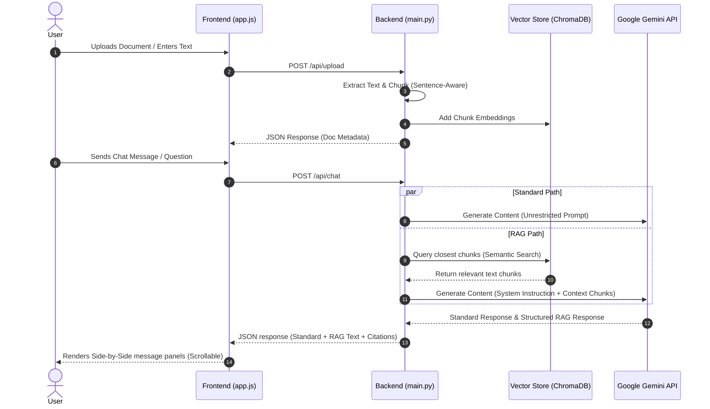

# RAG Visualizer 🚀

RAG Visualizer is an interactive, full-stack application designed to demonstrate the real-world value of **Retrieval-Augmented Generation (RAG)**. By presenting a **Standard AI Response** side-by-side with a **RAG-Grounded Response**, the app visually highlights the difference between generic LLM output and context-accurate, source-cited responses.

The application features a premium iOS-inspired dark mode theme (mimicking iMessage in night mode) with responsive side-by-side columns, fixed headers, independent panel scrolling, and persistent local document storage.

---

## Key Features

- **Multi-Format Document Ingestion**: Upload PDFs, Word documents (`.docx`), plain text files (`.txt`), or paste raw text snippets.
- **Side-by-Side Dual Response Chatbot**:
  - 🌐 **Standard Knowledge**: General response using the model's public training data.
  - 🟢 **RAG Response**: Response strictly grounded in uploaded documents, featuring automatic citation of source chunks.
- **Smart Scope Enforcement**: When queries fall outside the scope of the uploaded knowledge base, the RAG model politely redirects the user and steers the conversation back to the document topics.
- **Local Semantic Search**: Uses vector embeddings computed locally via ChromaDB and sentence-transformers. No third-party API is used for computing embeddings.
- **Responsive iMessage Aesthetic**: Clean pure black background, iOS-style gray cards, system fonts, and a vertical stacked column layout on mobile devices.

---

## Tech Stack & Components

| Layer | Component | Description |
|---|---|---|
| **Frontend** | Vanilla HTML5 / CSS3 / JavaScript | Client-side interface modeled after iOS dark mode. Responsive, animated, and fast. |
| **Markdown Parsing** | `marked.js` & `DOMPurify` | Formats and sanitizes rich Markdown responses securely on the frontend. |
| **API Backend** | FastAPI (Python) | High-performance async web framework managing document ingestion, search, and LLM orchestration. |
| **Vector Database** | ChromaDB (Local Persistent Client) | Stores document chunk embeddings locally under `backend/chroma_db/`. |
| **Default Embeddings** | `all-MiniLM-L6-v2` | Runs locally via ChromaDB's ONNX runtime to embed documents and queries. |
| **Language Model** | Google Gemini 3.6 Flash | The primary reasoning model used to generate both standard and RAG responses. |
| **Document Processing** | PyMuPDF (`fitz`) & `python-docx` | Robust text extractors for extracting text cleanly from PDF and DOCX files. |

---

## How It Works (Architecture)



---

## Directory Structure

```
rag-visualizer/
├── README.md                  # Project overview & guide
├── .gitignore                 # Prevents pushing caches, DBs, and credentials
├── backend/
│   ├── main.py                # FastAPI entry point, endpoints, & static mounting
│   ├── document_processor.py  # Ingestion & sentence-boundary chunking logic
│   ├── rag_engine.py          # ChromaDB connection & metadata registry
│   ├── llm_client.py          # Gemini API integrations
│   ├── requirements.txt       # Python package dependencies
│   ├── doc_registry.json      # (Ignored) Local registry for document listings
│   ├── chroma_db/             # (Ignored) Local SQLite vector database folder
│   └── uploads/               # (Ignored) Temporary uploaded files cache
└── frontend/
    ├── index.html             # Chat UI structural frame
    ├── styles.css             # iMessage dark mode responsive styling
    ├── pages.css              # Styling for helper pages
    ├── app.js                 # API bindings, drag-drop, and state rendering
    ├── about.html             # Help page explaining how the app works
    └── learn-rag.html         # Informational page teaching the concepts of RAG
```

---

## Setup Instructions

### 1. Clone the repository
```bash
git clone <your-repo-url>
cd rag-visualizer
```

### 2. Configure Python Virtual Environment
Navigate to the `backend/` directory and configure a virtual environment:
```bash
cd backend
python3 -m venv .venv
source .venv/bin/activate
```

### 3. Install Dependencies
Install Python libraries (PyMuPDF, ChromaDB, Uvicorn, FastAPI, google-genai, etc.):
```bash
pip install -r requirements.txt
```

### 4. Provide Gemini API Key
RAG Visualizer requires a Google Gemini API key to run chat completions. Get one free from [Google AI Studio](https://aistudio.google.com/apikey).

Choose one of two ways to configure it:
* **Option A: Environment Variable** (Mac/Linux):
  ```bash
  export GEMINI_API_KEY="your-api-key-here"
  ```
* **Option B: Environment File** (Recommended):
  Create a `.env` file in the `backend/` folder:
  ```env
  GEMINI_API_KEY=your-api-key-here
  ```
  *(Note: `.env` is already configured in `.gitignore` so your API key will remain safe and will never be pushed to GitHub.)*

### 5. Run the Server
Launch the FastAPI server:
```bash
python3 main.py
```
By default, the server starts running at **http://localhost:8000** and automatically mounts the frontend static files at `/`.

---

## How to Use the App

1. **Open the Dashboard**: Visit [http://localhost:8000](http://localhost:8000) in your web browser.
2. **Load your Knowledge Base**:
   - **File Upload**: Drag and drop any `.pdf`, `.docx`, or `.txt` file into the sidebar dropzone, or click it to browse files.
   - **Raw Text Input**: Enter a title and paste block text into the text area in the sidebar, then click **Add to RAG**.
   - *RAG Status in the sidebar will update to show RAG Active along with the document count.*
3. **Delete Documents**: Clear any document from the database by clicking the `✕` delete button next to the file card in the sidebar.
4. **Chat & Compare**:
   - Ask questions like *"Explain the key points of the contract"* or *"What is my account number?"*.
   - View the side-by-side columns:
     - **Standard Knowledge** shows a generalized response.
     - **RAG Response** displays facts retrieved directly from your documents.
   - Click the source chips at the bottom of the RAG response to inspect preview snippets of the retrieved chunks.
5. **Test Out-of-Scope Behavior**: Ask something unrelated to your documents (e.g. *"Give me a cookie recipe"*). The RAG response column will display a warning badge and steer the conversation back to the document topics, while the standard column will answer normally.
