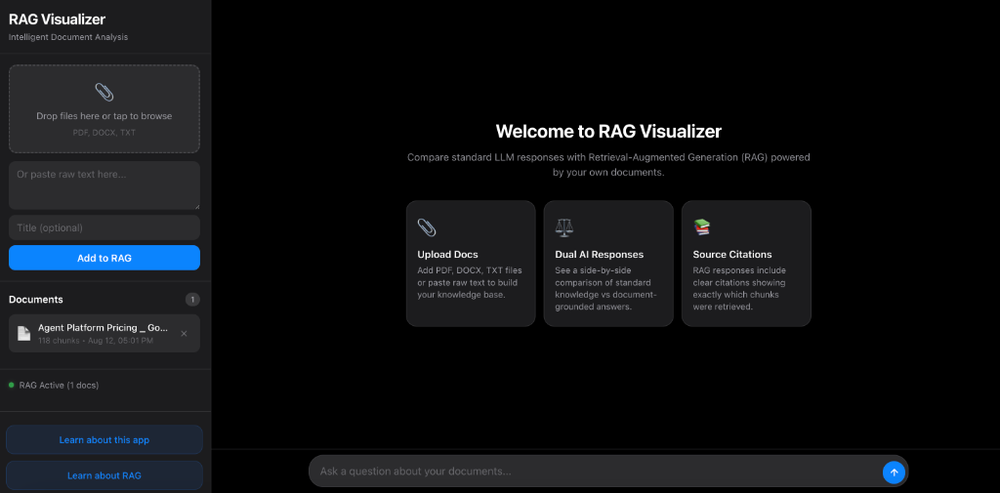
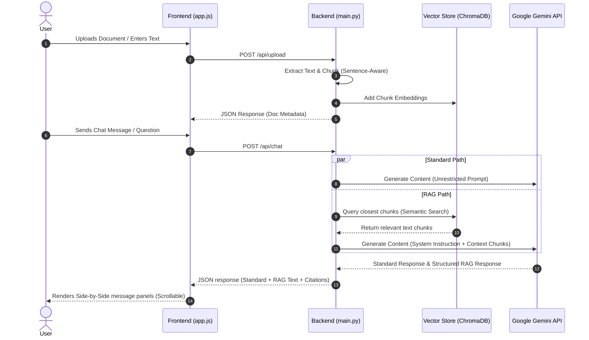

<p align="center">
  
</p>

<h1 align="center">RAG Visualizer</h1>

<p align="center">
  <strong>Compare standard AI knowledge with document-grounded RAG responses side-by-side.</strong>
</p>

<p align="center">
  <a href="#features">Features</a> •
  <a href="#how-it-works">How It Works</a> •
  <a href="#getting-started">Getting Started</a> •
  <a href="#directory-structure">Directory Structure</a> •
  <a href="#tech-stack">Tech Stack</a> •
  <a href="#security-audit">Security Audit</a>
</p>

---

## Overview

RAG Visualizer is an interactive, full-stack application designed to demonstrate the real-world value of **Retrieval-Augmented Generation (RAG)**. By presenting a **Standard AI Response** side-by-side with a **RAG-Grounded Response**, the app visually highlights the difference between generic LLM outputs and context-accurate, source-cited responses in real time.

The application features a premium iOS-inspired dark mode theme (mimicking iMessage in night mode) with responsive side-by-side columns, fixed headers, independent panel scrolling, and persistent local document storage.

---

## Features

### 📁 Multi-Format Ingestion
Upload files or paste plain text directly into the RAG database:
- **PDF Extraction**: Uses PyMuPDF to extract text cleanly.
- **Word Extraction**: Uses `python-docx` to extract structured paragraph text.
- **Text Files**: Directly reads UTF-8 plain text notes and logs.
- **Raw Text Box**: Paste raw blocks of text and assign custom titles.

### 📚 Side-by-Side Comparison
Every question triggers two different completions concurrently:
- 🌐 **Standard Knowledge**: General response using the model's public training data.
- 🟢 **RAG Response**: Response strictly grounded in uploaded documents, featuring automatic citation of source chunks.

### 🎯 Smart Scope Enforcement
The RAG model prompt enforces boundary control:
- Questions related to the documents are answered with grounding.
- Completely out-of-scope questions (e.g. asking for cooking recipes on a banking app) trigger a warning badge and a polite redirect steering the conversation back to the document topics.

### 🔍 Local Semantic Search
- Powered by **ChromaDB**'s persistent vector client.
- Automatically generates embeddings locally using the default `all-MiniLM-L6-v2` transformer model via ONNX runtime—meaning no third-party APIs are called for embeddings.

### 🎨 iMessage Dark Mode Theme
- Pure black background (`#000000`) and dark gray cards matching iOS dark system colors (`#1c1c1e`, `#2c2c2e`).
- Pinned standard and RAG headers with independent body scroll panels.
- Custom custom scrollbars and snappy iOS-style transitions.
- Fully responsive layout that stacks columns vertically on mobile screens.

---

## How It Works



1. **Ingestion & Chunking**: Uploaded text is processed into chunks of ~500 characters, respecting sentence boundaries where possible.
2. **Indexing**: Chunks are embedded and stored in a local ChromaDB collection.
3. **Retrieval**: User queries trigger semantic similarity checks inside ChromaDB to retrieve the top 5 most relevant document chunks.
4. **Generation**: The context is appended to a strict prompt instructing the LLM (Gemini) to evaluate relevance, answer utilizing the context, and cite specific document sources.

---

## Getting Started

### Prerequisites
- **Python 3.10+**
- **Google Gemini API Key** (Free tier from [Google AI Studio](https://aistudio.google.com/apikey))

### Setup
1. **Clone the Repository**:
   ```bash
   git clone https://github.com/jcueto/rag-visualizer.git
   cd rag-visualizer
   ```

2. **Configure Virtual Environment**:
   ```bash
   cd backend
   python3 -m venv .venv
   source .venv/bin/activate
   ```

3. **Install Packages**:
   ```bash
   pip install -r requirements.txt
   ```

4. **Add your API Key**:
   Create a `.env` file in the `backend/` directory:
   ```env
   GEMINI_API_KEY=your-api-key-here
   ```
   *(Note: `.env` is already configured in `.gitignore` so your API key will remain safe and will never be pushed to GitHub.)*

5. **Start the App**:
   ```bash
   python3 main.py
   ```
   Open **http://localhost:8000** in your web browser.

---

## Directory Structure

```
rag-visualizer/
├── README.md                  # Detailed overview & guide
├── .gitignore                 # Prevents pushing caches, DBs, and credentials
├── docs/
│   └── hero.png               # Visual header image mockup
├── backend/
│   ├── main.py                # FastAPI entry point, endpoints, & static mounting
│   ├── document_processor.py  # Ingestion & sentence-boundary chunking logic
│   ├── rag_engine.py          # ChromaDB connection & metadata registry
│   ├── llm_client.py          # Gemini API integrations & model versioning
│   ├── requirements.txt       # Python package dependencies
│   └── .env                   # (Local-only) API Key configuration
└── frontend/
    ├── index.html             # Main dashboard shell
    ├── styles.css             # iMessage dark mode responsive styling
    ├── pages.css              # Styling for helper pages
    ├── app.js                 # API bindings, UI events, and DOM rendering
    ├── about.html             # "Learn about this app" help page
    └── learn-rag.html         # "Learn about RAG" educational page
```

---

## Tech Stack

- **Backend Framework**: FastAPI (Uvicorn server)
- **Vector Database**: ChromaDB (local persistence client)
- **Language Model**: Google Gemini 3.6 Flash (via `google-genai` SDK)
- **Text Extractors**: PyMuPDF (PDFs) and `python-docx` (DOCX files)
- **Frontend Engine**: Vanilla HTML5, CSS3 (iMessage Theme), and JavaScript (ES6)
- **Markdown Processing**: `marked.js` with `DOMPurify` sanitizer

---

## Security Audit

To ensure maximum safety when publishing to a public repository:
1. **Configured `.gitignore`**: Blocks pushing sensitive data including local API keys (`backend/.env`), local SQLite ChromaDB stores (`backend/chroma_db/`), temporary files (`backend/uploads/`), and metadata registries (`backend/doc_registry.json`).
2. **Credential Sanitization**: The local repository's git remote credentials have been sanitized to remove raw Personal Access Tokens from the origin URL, protecting your terminal output and local configuration files.
